# PMC Analytics - Mermaid Diagrams
# These diagrams can be used in: Mermaid.live, GitHub, Confluence, Notion, etc.

## Diagram 1: Data Loading Priority Flow
## Usage: Copy this code block into https://mermaid.live

```mermaid
graph TD
    A["📖 Start: Load Project Data<br/>for 5-Week Window"] --> B{"Has scopes in<br/>projectScopes?"}
    
    B -->|Yes & dates overlap| C["✅ Use Project Scopes<br/>- Extract start/end dates<br/>- Calculate: manpower×10 or hours÷days<br/>Mark: In-Window Data Found"]
    B -->|No or outside window| D{"Has data in<br/>long term schedual?"}
    
    D -->|Yes & within window| E["✅ Use Long-term Data<br/>- Extract weekly hours<br/>- Divide by 5 for daily<br/>Mark: In-Window Data Found"]
    D -->|No or outside window| F{"Has allocation in<br/>schedules collection?"}
    
    F -->|Yes & month overlaps| G["✅ Use Schedules Allocation<br/>- Find Mondays in month<br/>- Calculate: totalHours × % ÷ Mondays ÷ 5<br/>Result: Hours per day"]
    F -->|No| H["❌ No data - Skip Project"]
    
    C --> I{"Already marked<br/>with data?"}
    E --> I
    G --> I
    
    I -->|Yes| J["🚫 Skip schedules collection<br/>Prevent duplication"]
    I -->|No| K["✅ Add to display"]
    
    J --> L{"Short-term schedual<br/>has foreman?"}
    K --> L
    H --> M["Project not shown"]
    
    L -->|Yes| N["👤 Add Foreman Overlay<br/>- Show foreman name<br/>- Allow X to remove<br/>Unassigned available"]
    L -->|No| O["Show with empty foreman<br/>Ready for assignment"]
    
    N --> P["🎯 Final Display<br/>Project + Hours + Foreman"]
    O --> P
    M --> Q["Hidden from view"]
    
    style A fill:#e1f5ff
    style C fill:#c8e6c9
    style E fill:#fff9c4
    style G fill:#f8bbd0
    style H fill:#ffccbc
    style J fill:#ffe0b2
    style N fill:#d1c4e9
    style P fill:#c8e6c9
    style M fill:#ffcdd2
    style Q fill:#ffcdd2
```

---

## Diagram 2: System Architecture
## Shows how 4 data sources feed into 3 schedule views

```mermaid
graph LR
    DB["🗄️ FIRESTORE DATA"]
    
    DB -->|Explicit dates<br/>start/end| SCOPES["📍 projectScopes<br/>- Scope definitions<br/>- Manpower or hours<br/>- Date ranges"]
    
    DB -->|Legacy monthly| LONGTERM["📅 long term schedual<br/>- Month-based<br/>- Weekly totals<br/>- Historical data"]
    
    DB -->|Current allocations| SCHEDULES["📊 schedules<br/>- Monthly %<br/>- Total hours<br/>- Source of truth"]
    
    DB -->|Daily assignments| SHORTTERM["👤 short term schedual<br/>- Foreman assignments<br/>- Daily hours detail<br/>- Override source"]
    
    SCOPES --> L1["🔵 LONG-TERM SCHEDULE<br/>15-week view<br/><br/>Priority:<br/>1. Scopes<br/>2. Long-term<br/>3. Schedules %<br/><br/>Output:<br/>Project cards by week"]
    
    SCOPES --> L2["🟢 PROJECT GANTT<br/>Monthly view<br/><br/>Priority:<br/>1. Scopes<br/>2. Short-term detail<br/>3. Long-term<br/>4. Schedules %<br/><br/>Output:<br/>Timeline bars"]
    
    LONGTERM --> L1
    SCHEDULES --> L1
    
    LONGTERM --> L2
    SCHEDULES --> L2
    SHORTTERM --> L2
    
    SCOPES --> L3["🟡 SHORT-TERM SCHEDULE<br/>5-week daily view<br/><br/>Priority:<br/>1. Scopes (if in window)<br/>2. Long-term (if no scope)<br/>3. Schedules % (if neither)<br/>4. + Foreman overlay<br/><br/>Output:<br/>Daily grid + crew"]
    
    LONGTERM --> L3
    SCHEDULES --> L3
    SHORTTERM --> L3
    
    L1 --> OUT1["📋 15-week project<br/>allocation view"]
    L2 --> OUT2["📊 Monthly timeline<br/>with scope detail"]
    L3 --> OUT3["👥 Daily schedule<br/>with crew assignment"]
    
    style DB fill:#fff3e0,stroke:#f57c00,stroke-width:3px
    style SCOPES fill:#e8f5e9,stroke:#388e3c,stroke-width:2px
    style LONGTERM fill:#fff9c4,stroke:#f57f17,stroke-width:2px
    style SCHEDULES fill:#fce4ec,stroke:#c2185b,stroke-width:2px
    style SHORTTERM fill:#e1f5fe,stroke:#01579b,stroke-width:2px
    style L1 fill:#bbdefb,stroke:#1565c0
    style L2 fill:#c8e6c9,stroke:#388e3c
    style L3 fill:#ffe0b2,stroke:#e65100
    style OUT1 fill:#bbdefb
    style OUT2 fill:#c8e6c9
    style OUT3 fill:#ffe0b2
```

---

## Diagram 3: Hour Distribution Calculation
## Example: Canine Partners - 50% allocation for March

```mermaid
graph TD
    A["📊 USER ENTERS ALLOCATION<br/>In Scheduling Page<br/>Project: Canine Partners<br/>Total Hours: 531<br/>March 2026: 50%"] --> B["💾 SAVED TO:<br/>schedules collection<br/>allocations: {'2026-03': 50}"]
    
    B --> C["📖 DISPLAY PAGE LOADS<br/>Today: Feb 24, 2026<br/>5-Week Window: Feb 23 - Mar 30"]
    
    C --> D["🔍 FIND APPLICABLE MONTH<br/>Check if 2026-03 overlaps window<br/>March 1-31 overlaps with Feb 23-Mar 30<br/>✅ YES - Include March"]
    
    D --> E["📅 CALCULATE MONTH HOURS<br/>monthHours = totalHours × percent ÷ 100<br/>= 531 × 50 ÷ 100<br/>= 265.5 hours for March"]
    
    E --> F["🗓️ FIND MONDAYS IN MONTH<br/>WITHIN 5-WEEK WINDOW<br/>March 2026 Mondays:<br/>Mar 02, 09, 16, 23, 30<br/><br/>Window ends: Mar 30<br/>Valid Mondays: 02, 09, 16, 23<br/>(4 weeks in window)"]
    
    F --> G["⏰ DISTRIBUTE ACROSS WEEKS<br/>hoursPerWeek = monthHours ÷ validMondays<br/>= 265.5 ÷ 4<br/>= 66.375 hours/week"]
    
    G --> H["📆 SPLIT ACROSS WEEKDAYS<br/>hoursPerDay = hoursPerWeek ÷ 5 work days<br/>= 66.375 ÷ 5<br/>= 13.275 hours/day"]
    
    H --> I["🎯 APPLY TO SCHEDULE<br/>Week of Mar 02: ~13.3 hrs/day<br/>Week of Mar 09: ~13.3 hrs/day<br/>Week of Mar 16: ~13.3 hrs/day<br/>Week of Mar 23: ~13.3 hrs/day"]
    
    I --> J["👤 OVERLAY WITH FOREMAN<br/>If assigned in short-term schedual:<br/>Show foreman name<br/>Allow X to remove<br/><br/>IF NOT assigned:<br/>Show in Unassigned row<br/>Ready for crew dispatch"]
    
    J --> K["✅ FINAL RESULT<br/>Canine Partners visible Mar 02-23<br/>~13 hours per day<br/>Unassigned or assigned to crew"]
    
    style A fill:#fff3e0,stroke:#f57c00,stroke-width:2px
    style B fill:#fce4ec,stroke:#c2185b,stroke-width:2px
    style C fill:#e1f5fe,stroke:#01579b,stroke-width:2px
    style D fill:#e8f5e9,stroke:#388e3c,stroke-width:2px
    style E fill:#f3e5f5,stroke:#6a1b9a,stroke-width:2px
    style F fill:#fff9c4,stroke:#f57f17,stroke-width:2px
    style G fill:#ffe0b2,stroke:#e65100,stroke-width:2px
    style H fill:#ffccbc,stroke:#d84315,stroke-width:2px
    style I fill:#b2dfdb,stroke:#00695c,stroke-width:2px
    style J fill:#e0f2f1,stroke:#004d40,stroke-width:2px
    style K fill:#c8e6c9,stroke:#2e7d32,stroke-width:3px
```

---

## How to Use These Diagrams

### Option 1: Online Viewer (Free)
1. Go to https://mermaid.live
2. Copy any diagram code above
3. Paste it into the editor
4. Download as PNG, SVG, or PDF

### Option 2: In GitHub
1. Create a `.md` file in your repo
2. Paste the mermaid code block
3. GitHub automatically renders it
4. Right-click to download as image

### Option 3: In Confluence/Notion
1. Look for "Mermaid" diagram option
2. Copy the code without the \`\`\` markers
3. Paste into diagram editor

### Option 4: In VS Code
1. Install "Markdown Preview Enhanced" extension
2. Open this file in VS Code
3. Right-click → "Open Preview"
4. Diagrams render live
5. Right-click diagram → "Save as PNG"

---

## Customization

All diagrams use color coding:
- 🟦 Blue: Long-term schedule
- 🟩 Green: Completed/Success states
- 🟨 Yellow: Legacy/Fallback data
- 🟥 Red: Errors/Skipped items
- 🟪 Purple: Intermediate steps

You can modify colors by changing the `style` sections at the bottom of each diagram.

---

Generated: February 24, 2026
PMC Analytics Team
