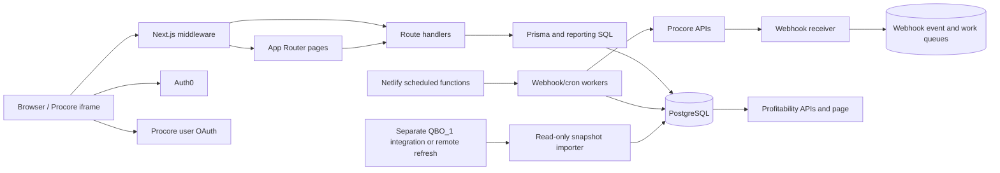

# Analytics application architecture

Last verified against the repository on 2026-08-26.

This document is the fast-start map for the application. It describes the current implementation, including transitional systems that have not yet been retired. When it conflicts with executable code, `prisma/schema.prisma`, or a migration, those sources win and this map should be updated.

## Purpose

This repository is an internal construction operations and analytics application. It combines:

- project, KPI, estimating, scheduling, workforce, equipment, and onboarding workflows;
- Procore project, estimating, budget, commitment, timecard, productivity, and change-management data;
- read-only QuickBooks project-profitability snapshots; and
- scheduled reconciliation, notification, and health-monitoring jobs.

It is a single Next.js application rather than a collection of independent services. Most browser pages call local Next.js route handlers, and those route handlers read or write PostgreSQL through Prisma.

## System at a glance



The important boundary is that interactive analytics reads use PostgreSQL. Procore network calls belong in OAuth-enabled tools, explicit maintenance operations, or secret-authenticated sync workers.

## Runtime and deployment

| Concern | Implementation |
| --- | --- |
| Web framework | Next.js 16 App Router, React 19, TypeScript |
| Database | PostgreSQL through Prisma 6 |
| Hosting | Netlify; `netlify.toml` publishes `.next` |
| Scheduled/background work | Netlify functions in `netlify/functions/` calling internal cron/sync routes |
| User authentication | Auth0 v4 through `src/lib/auth0.ts` and `middleware.ts` |
| Procore authentication | User OAuth cookies for interactive work and client credentials for server workers |
| Tests | Node's built-in test runner over `test/*.test.mjs` |
| Styling/UI | App-level CSS plus React components; Chart.js and PDF libraries are used by reporting surfaces |

`src/app/layout.tsx` installs `AppChrome` and starts permission initialization. `src/app/page.tsx` is the operational home page. Navigation and feature visibility are assembled in `src/components/Navigation.tsx` and the permission helpers.

## Repository map

| Path | Responsibility |
| --- | --- |
| `src/app/` | App Router pages, layouts, and API route handlers |
| `src/app/api/procore/` | Interactive Procore tools, sync endpoints, clone/migration operations, and live-mirror reads |
| `src/app/api/cron/` | Secret-authenticated incremental, nightly, reconciliation, reminder, notification, and health work |
| `src/app/api/webhooks/procore/` | Durable Procore webhook receipt and queued processing |
| `src/lib/` | Database, authentication, permissions, analytics, project identity, Procore, QBO, and scheduling domain logic |
| `src/lib/scheduling/` | Bridges between Gantt and legacy scheduling representations |
| `prisma/schema.prisma` | Current Prisma model surface |
| `prisma/migrations/` | Deployed database evolution and materialized-view/index changes |
| `netlify/functions/` | Schedulers and long-running wrappers for internal API workers |
| `scripts/` | Imports, audits, backfills, repairs, reconciliation, and controlled manual syncs |
| `test/` | Focused business-logic and source-contract tests |
| `config/` | Versioned cost-code and PMC grouping configuration |
| `docs/` | Current operational and architecture notes |
| `data/`, `logs/`, `snapshots/`, `repair-plans/` | Evidence, exports, audit results, and operational plans; not application source of truth |

## Request authentication and permissions

### Auth0 session

`src/lib/auth0.ts` configures the Auth0 client. Next.js discovers `src/middleware.ts` beside `src/app`; that entry point re-exports the existing policy from root `middleware.ts` and declares its static matcher. The policy enforces sessions for normal pages and APIs, returns JSON errors to unauthorized API callers, and redirects browser requests to login where appropriate. Session cookies use `SameSite=None` and `Secure` so the application can operate inside an allowed Procore iframe. Verify the generated middleware manifest and unauthenticated page/API responses when deploying.

Both middleware matchers exclude the seven exact Netlify `/api/background/` worker paths. These are platform functions, not Next.js routes; allowing `NextResponse.next()` inside middleware does not keep the adapter from routing them into the Next.js handler. Each excluded function requires `x-sync-secret` before performing work. Cron routes remain matched and retain their own secret checks. Keep the authenticated-worker exemption from the browser heavy-route IP limiter. Validate routing, adjacent-path protection, and missing/invalid-secret rejection with `node --test test/procoreWorkerRouting.test.mjs test/permissions.test.mjs test/procoreSyncReliability.test.mjs`.

`/pm-dashboard` also accepts a short-lived signed local identity established by the existing Procore OAuth callback. The callback resolves the authenticated user through Procore's `/rest/v1.0/me` endpoint; middleware still checks the local `pm-dashboard` permission before allowing the page or its data API. A request without either an Auth0 session or that verified Procore identity is redirected into Procore OAuth rather than receiving anonymous access.

Field Productivity review completion and undo (`POST`/`DELETE /api/analytics/commitment-productivity/reviews`) also accept that verified Procore identity, with the same `analytics` permission as the page and the existing same-origin CSRF check. The read-only Procore link cookie cannot authorize a review write. Review attribution uses the verified session email; if no session is available, the completion dialog offers Procore sign-in and requires the user to submit again afterward. Validate with `node --test test/productivityReviewAuth.test.mjs test/permissions.test.mjs test/procoreUserSession.test.mjs`.

### Permission resolution

The access path is:

1. `src/lib/permissionRoutes.js` maps page and API prefixes to permission keys.
2. `middleware.ts` determines the required key, including a few route-specific fallbacks.
3. `src/lib/permissions.ts` loads user assignments from the database and expands permission groups/templates. Environment JSON is a compatibility fallback.
4. A signed permission cookie reduces repeated database checks, but the Auth0 identity remains the session source.

When adding a protected page and API, update both route maps and confirm that the intended permission appears in navigation. Special unauthenticated paths are intentionally narrow: Auth0 routes, the public version endpoint, Procore webhook receipt, secret-authenticated worker routes, and limited Procore-session analytics entry.

### Diagnostics and rate limits

Direct Cost Bills has its own `accounting-direct-cost-bills` permission, labeled **QBO Direct Costs** in employee navigation permissions. It controls the navigation link, `/accounting/direct-cost-bills`, and all `/api/accounting/direct-cost-bills` operations including setup and sync. OWNER/ADMIN groups and the existing admin fallback retain access. QBO P&L remains independently controlled by `accounting-project-profitability`; granting P&L alone does not grant bill access. No individual employee assignments are automatically changed. Validate with `node --test test/permissions.test.mjs`.

Production diagnostics/test routes are blocked unless explicitly enabled. Middleware also applies general API rate limits and stricter limits to expensive Procore sync/estimating routes. Preserve those controls when moving or renaming endpoints.

## Procore integration

### Central client

`src/lib/procore.ts` owns the base URLs, redirect resolution, OAuth exchanges, client-credentials token cache, outbound request timeout, the `Procore-Company-Id` header, and 429 retry behavior.

There are two authentication lanes:

- Interactive lane: `/api/auth/procore/login` and `/api/auth/procore/callback` obtain a user OAuth session used by browser-driven tools.
- Worker lane: scheduled jobs use client credentials and authenticate internal calls with `x-sync-secret` or a bearer equivalent.

Outbound requests through `makeRequest` are blocked when `PROCORE_LIVE_API_ENABLED` is false unless the call is inside an approved authenticated-session or sync-secret bypass. Normal production browsing should not require the global live-API switch.

Commitment Maker project hydration reads approved COs, purchase orders, and vendor identity from synchronized PostgreSQL so opening a Project Home link does not wait on sequential Procore APIs. PO vendor names fall back through the project and company vendor mirrors when the commitment snapshot contains only a vendor ID. Preview/create still resolve the selected CO and validate the write target against authoritative live Procore data before any mutation. Estimate imports resolve workbook base cost codes against the selected project's WBS. Approved change-order imports retain each source line's project WBS ID and cost type. Procore requires that Budget Code on every created purchase-order or commitment-change-order line, so unresolved lines block creation during preview rather than being submitted without a WBS assignment. New-PO retries identify an existing result by the server-generated change-order title plus the fixed vendor because Procore's Commitment Contracts v2 read response does not expose the submitted `origin_data`; an Approved match wins over a partial Draft. Existing-PO vendor checks use the normalized Procore vendor name because the commitment response's project-scoped vendor ID can differ from the company-directory vendor ID. Before any Procore mutation, approved-CO imports atomically claim their source identities in `commitment_maker_change_order_applications` and `commitment_maker_change_order_aliases`. The alias primary key is project-wide, and a PCCO claims both its package ID and every contained PCO ID, so one business change order cannot be added twice to the same PO or redirected to another PO. Active claims use a five-minute lease; failed or expired work may resume only against its originally claimed target.

Commitment Maker live calls use `src/lib/procoreCommitmentMakerClient.ts` in a request-scoped context. The client reports low quota and 429 responses to the shared background cooldown, pauses when the reported remaining balance reaches zero, and retries only explicit 429 rejections (including writes). All calls in one incoming request share an eight-second wait budget, with at most two retries per rejected operation; longer resets return a 429 with `rateLimitUntil` and `Retry-After` instead of retrying before the provider reset. The create route saves confirmed line ownership and marks the attempt retryable while retaining its original target before returning a resumable pause. The page keeps one loading state across longer waits through `src/lib/commitmentMakerRequest.ts` and resends the unchanged, previously confirmed request only when the server marks it `retryable`. Approved-CO continuation remains bound to its durable target claim and revalidates the original fingerprint and existing lines on every attempt. Estimate imports may repeat automatically only before any PO was created. The browser allows at most ten continuations within 65 minutes, cancels pending waits when the page unmounts, and displays only the final result without rate-limit or retry notices. Timeout/disconnect outcomes remain blocked for reconciliation and are never replayed automatically. Validate with `node --test test/commitmentMakerRequest.test.mjs test/procoreCommitmentMakerClient.test.mjs test/procoreCommitmentMakerChangeOrders.test.mjs test/procoreCommitmentMakerChangeOrderClaims.test.mjs`.

When users combine new purchase orders, matching cost code, cost type, source WBS ID, description, and UOM lines merge even if unit costs differ. Opposite quantity signs remain separate. The combined line uses a quantity-weighted unit cost at four decimal places and retains the summed original line amounts in `subtotalOverride`; preview totals, server normalization, and Procore payloads use that explicit amount to avoid rounding drift. Ordinary imports keep different prices separate until the user chooses Combine. Validate with `node --test test/commitmentMaker.test.mjs`.

Approved change-order imports accept finite negative quantities and unit costs, retaining the source sign and any explicit line amount that differs after unit-cost rounding. Zero/missing quantities and missing/invalid unit costs remain excluded. Estimate-detail enrichment matches the absolute credit quantity and amount, then preserves the signed quantity and amount on its output. If an approved-CO preview finds no mirrored lines, it performs a bounded live read for that exact project and source ID, rechecks Approved status, and uses the returned detail; previews with stored lines continue to use PostgreSQL. This fallback does not create or modify anything in Procore. Validate with `node --test test/procoreCommitmentMakerChangeOrders.test.mjs`.

Commitment Maker vendor enrollment verifies exact project membership through the bounded live client before attempting an add. A same-name record with a different ID is not proof of enrollment; historical project-scoped vendor IDs remain attached to existing POs, while new POs prefer the canonical company-directory vendor. Validate with `node --test test/commitmentMakerVendorEnrollment.test.mjs`.

Commitment Maker's project selector reads the configured company's `PmcProject` identity/display fields through `GET /api/procore/commitments-live/maker/projects`. This endpoint inherits `procore-commitments` authorization, so a user with Commitment Maker access does not also need the broader `procore` permission for `/api/procore/projects`. The collection requires an authenticated Analytics session; signed Project Home links remain limited to their single project. Validate with `node --test test/commitmentMakerProjects.test.mjs`.

Commitment Maker previews cache complete WBS reads for 24 hours in `procore_wbs_caches`, keyed by company and Procore project ID. Cached previews do not acquire a Procore token or issue a live WBS request; unresolved cached codes trigger one fresh read. Creation always revalidates WBS live and cannot substitute cached data on failure. Live reads use WBS first and budget lines only as a fallback. A 429 propagates to silent browser continuation; failed reads preserve their actual cause. Validate with `node --test test/procoreWbsCache.test.mjs test/commitmentMakerWbsRead.test.mjs`.

The centralized Procore client and Commitment Maker use the same PostgreSQL request-gate implementation. The shared Analytics connection uses `procore_request_gates`; dedicated apps use separate tables described below. Within each connection, each company has one expiring outbound-request lease, and admission debits every unexpired observed rate window before sending. Completion updates the matching owner's window and releases the lease; a stale owner cannot clear a newer lease. The gate retains separate limits when headers alternate between hourly and spike windows, pauses both lanes at exhaustion, and gives interactive callers a renewable 15-second priority interval over background syncs. The default background reserve is 200, capped at 25% of the reported limit (150 of an observed 600); `PROCORE_API_BACKGROUND_RESERVE` overrides the default. Existing workers defer through their ordinary 429/resume flow. Request accounting failures after a successful mutation cannot trigger its replay. `procore_api_usage` aggregates hourly counts by company, lane, sanitized endpoint, and status; it stores no query strings, credentials, or payloads. The secret-protected sync health GET includes the top 30 endpoint totals for the last 24 hours. Validate with `node --test test/procoreRequestBudget.test.mjs test/procoreCommitmentMakerClient.test.mjs test/procoreSyncReliability.test.mjs`. Opt-in PostgreSQL validation is `PROCORE_CAPACITY_DATABASE_TEST=1 node --test test/procoreRequestGate.database.test.mjs` with the intended database configured; it uses temporary tables and rolls back all test writes.

Commitment Maker defaults to **Procore Primary Estimate**. Its existing project GET returns the synchronized primary name; preview resolves the company's exact Bid Board link and selects only an `ESTIMATE` with `is_primary === true`. Missing or multiple primary flags block import; names, totals, baseline flags, alternate inclusion and revision dates cannot select a substitute. The browser submits combine commands, while `src/lib/procoreCommitmentMakerEstimateSource.ts` loads complete proposal/group/line collections through the shared interactive client and `src/lib/procore/commitmentMakerEstimate.ts` reconstructs PO groups on the server. Five-minute complete snapshots live in `procore_commitment_estimate_caches`; Refresh and creation always reread Procore without stale fallback. The preview fingerprint includes proposal identity, source update time and transformed groups. Hourly labor remains zero-priced, ordinary lines use estimate costs with explicit extended amounts, and existing exclusions still apply. Missing budget codes block validation instead of silently dropping scope.

Primary-estimate creation atomically claims one base-estimate application per company/project in `commitment_maker_estimate_imports`. Each accepted PO ID is persisted before writing its lines. Explicit rate-limit failures can resume only the identical source/grouping against those same targets, including after page reload; completed, uncertain or still-running imports cannot be claimed again. A crashed running attempt requires reconciliation, rather than expiring into a duplicate create. Successful historical workbook audits also block a second base-estimate import. Workbook upload and approved-CO flows remain available. Validate with `node --test test/commitmentMakerPrimaryEstimate.test.mjs test/commitmentMaker.test.mjs`; opt-in PostgreSQL validation is `PROCORE_ESTIMATE_DATABASE_TEST=1 node --test test/commitmentMakerPrimaryEstimate.database.test.mjs`, which uses temporary tables and rolls back all writes.

Estimate line responses can omit Cost Catalog budget assignments. The primary-estimate reader retrieves referenced catalog items through the same company-scoped interactive client and deduplicates exact item lookups (including custom items). An item's catalog location can change after the estimate was saved, so the lookup uses company plus item ID, never the estimate's historical catalog ID or item name. Only cost code and cost type are copied; estimate-specific assignments and all estimate quantities/prices take precedence. Coding-aware snapshots are versioned so older uncoded caches cannot bypass the lookup. A failed catalog read cannot publish a partial snapshot or use stale catalog assignments for creation.

Primary-estimate preparation checkpoints each successful Procore GET in `commitment_maker_estimate_reads`, using an opaque operation ID bound to company, project, Bid Board and preview/create mode. Each HTTP request admits at most four uncached reads and stops admitting reads after five seconds, leaving room for the shared client's network timeout and quota wait. HTTP 202 continuations keep the existing spinner and resume saved reads; a provider cooldown preserves those checkpoints and its reset time. Completed source loading always yields before WBS validation/planning, and the next request rechecks the live primary selection. Preparation expires after 65 minutes; completed preparation can be used for five minutes. No partial source enters the complete snapshot cache, no preview operation can authorize create, and no mutation timeout is automatically replayed. Validate with `node --test test/commitmentEstimateRead.test.mjs test/commitmentMakerPrimaryEstimate.test.mjs test/commitmentMakerRequest.test.mjs`; `PROCORE_ESTIMATE_DATABASE_TEST=1 node --test test/commitmentEstimateRead.database.test.mjs` verifies checkpoint SQL in a rolled-back temporary table.

### IDs and source systems

Keep these identifiers distinct:

| Identifier | Meaning |
| --- | --- |
| `companyId` / `company_id` | Procore company scope |
| `procoreProjectId` / `procore_project_id` | Project ID used by project-scoped Procore APIs and canonical joins |
| `bidBoardId` / `bid_board_id` | Estimating bid-board project ID |
| `proposalId`, `bidPackageId`, `bidFormId`, `bidId` | IDs inside the estimating hierarchy |
| Prisma `id` | Local row identity; not automatically an external project ID |
| `jobKey`, name, customer, project number | Display and compatibility fields, not reliable primary joins |

The current application still contains older paths that use `Project.id`, `jobKey`, or fallback matching. New work should prefer explicit `companyId + procoreProjectId` joins and should not introduce more fuzzy runtime identity.

### Persistence layers

Procore data is stored in several intentional layers:

- Canonical project direction: `PmcProject` and `PmcBidBoardProject` (`pmc_projects`, `pmc_bid_board_projects`).
- Transitional local project/scheduling models: `Project`, `ProjectScope`, `Schedule`, `ScheduleAllocation`, `ActiveSchedule`, and `ScopeTracking`.
- Gantt v2: `GanttV2Project`, `GanttV2Scope`, and `GanttV2ScheduleEntry`.
- Transactional mirrors: timecards, productivity logs, budgets, commitments, purchase-order detail, estimates, and change orders.
- Raw/live/staging mirrors: `procore_*_live`, estimating/bid tables, staging rows, and preserved JSON payloads.
- Operational state: webhook events/queue, project sync state/control, Commitment Maker source-CO applications, run logs, and productivity/timecard notification records.

`PmcProject` is the destination for canonical identity, but the migration is incomplete. Project sync and webhook handlers still update legacy rows, and scheduling uses explicit bridge code between Gantt and `ProjectScope`. Do not remove a legacy write or table because a `pmc_*` equivalent exists; first trace all reads, dual writes, backfills, and parity checks.

### Full and incremental syncs

The broad sync runner in `src/lib/cronSync.ts` calls focused route handlers for projects, bids, estimates, budget line items, commitments, purchase-order details, timecards, and productivity logs. It records a `SyncLog` and refreshes these materialized views when present:

- `bid_board_latest_mv`
- `budget_agg_mv`
- `commitments_agg_mv`

For steady-state operation, `netlify/functions/scheduled-sync.mts` runs every five minutes. It:

1. drains queued Procore webhook events;
2. reconciles productivity-review reminders;
3. processes timecard notifications;
4. dispatches a background worker that claims a small number of due project-scoped PCO/PCCO header checks from the shared Procore queue and queues newly approved verification tasks; and
5. dispatches actuals or nightly-structure work according to the America/New_York time window.

The background wrappers call `/api/cron/actuals`, `/api/cron/nightly-structure`, `/api/cron/project-onboarding`, `/api/cron/change-order-approvals`, and `/api/cron/project-reconciliation` in bounded batches. Queue state, locks, retry timestamps, and Procore quota state live in PostgreSQL so work can resume across invocations. Change-order approval detection uses the same company worker lock as every other background Procore reader; it no longer performs a full sweep of every known change-order project on each five-minute scheduler tick. Active change-order projects normally requeue after 90 minutes, inactive projects with historical COs requeue after six hours, and no more than three project checks are attempted per tick. Concurrent Actuals and change-order wrappers briefly retry a busy shared worker within their bounded invocation so either dispatcher winning the first lease cannot starve the other queue. The Actuals and nightly-structure wrappers decide how to react to each route response through `src/lib/procoreWorkerBackoff.js`: a `worker_busy` skip waits one second (up to 20 times), a cooldown or mid-sync deferral whose reset is within 45 seconds is waited out (up to 6 times) before re-claiming, and a longer cooldown or any other skip ends the loop. Without this, the short reserve cooldowns armed by Procore's small rolling window made every wrapper abandon its tick after a single project.

The shared Procore client records low-water quota headers, honors the provider reset epoch, and reserves a configurable request balance for interactive and mutation traffic. Secret-authenticated route responses include the exact observed cooldown and the number of outbound Procore requests, allowing parent workers to retain provider reset timing and record per-step request consumption. Every sync-secret request checks that shared cooldown before calling Procore (with a short in-process negative cache so paced syncs do not query the database per request); user-session requests remain available. In-process 429 retries happen only when `x-rate-limit-reset`/`Retry-After` falls within `PROCORE_API_RETRY_MAX_MS`; once the window is exhausted the client fails fast and relies on the persisted cooldown, because each capped retry would be another quota-consuming 429. The observed production limit is 600 requests per rolling window, not the commonly assumed 3,600. Provider-wide throttling defers claimed queue records until the exact reset with deterministic jitter, is logged as a successful deferral rather than a project failure, and does not increment project failure counters.

The webhook processor applies the same rule: it returns `deferred` without claiming a batch while a cooldown is active, and a throttled handler releases its claim, restores the consumed attempt, and reschedules the item for the cooldown end (parking the remainder of the batch alongside it). Handlers that soft-delete a local mirror row on a missing Procore record do so only for a real 404; any other error propagates so the queue retries rather than corrupting data.

The PM dashboard sweep (`/api/cron/pm-dashboard`) takes its configured Procore connection/company worker lease and uses `src/lib/procorePollingPolicy.ts` to classify canonical projects: active projects poll every `PM_DASHBOARD_REPOLL_MINUTES` (default 90), bidding projects every six hours, and completed/Post-Construction projects daily. Templates and cancelled/lost projects are excluded from automatic sweeps; an explicitly requested project remains available for a targeted refresh. Bid Board status takes precedence over portfolio status. Selection orders projects by their actual due time so slower closeout work does not crowd out active work.

Normal Actuals polling bootstraps each project with the configured historical window, then uses its last successful sync as a watermark with a three-day overlap. This preserves late edits without rereading the default 45-day range every 90 minutes. The 400-day safety reconciliation rotates through bounded 100-day project chunks and persists its cursor in `procore_sync_project_states.last_result`; unfinished chunks requeue promptly while completed cycles pause for a day. The dispatcher remains hourly so the reconciliation request budget is spread across the week instead of producing long, timeout-prone reads.

Actuals retains its configured active interval (default 90 minutes) until the project has complete create/update/delete timecard and productivity webhook coverage verified within eight days, no registration failures, and a successfully processed Actuals event received within seven days. With that evidence, the backup interval becomes three hours for recently active projects or six hours for quiet active projects. Idle projects retain their daily schedule. Health monitoring respects these explicit queue due times rather than alerting during an intentional wait. Empty purchase-order discovery checks back off from 30 minutes to at most one day; the consecutive-empty count lives in the existing queue result, does not advance on failures/throttling, and resets when lines are found. Daily structural reconciliation remains in place.

Health checks evaluate the age of queued Actuals, nightly structure, Bid Board header, estimate, and change-order approval work, not only the newest successful project. The full active-project reconciliation runs daily at 07:10 UTC and health monitoring allows 26 hours between successful completions. The Actuals wrapper advances due Actuals projects before secondary estimate, onboarding, and purchase-order work can consume the shared Procore quota. Bid Board header reconciliation defaults to hourly rather than every 15 minutes. Successful daily structure and estimate records requeue five minutes short of 24 hours so second-level scheduler jitter cannot push them past the final nightly tick. Secret-authenticated operators can pass one exact `projectId` to `/api/cron/nightly-structure` for a targeted structure rerun.

The scheduler suppresses its normal worker only after reconciliation dispatch returns HTTP 202. Dispatch failures, including change-order, Commitment Maker, and calendar workers, propagate into both the response status and `ok` field. A successful low-quota Procore response with missing/expired reset hints pauses background work for at most 30 seconds instead of the unexplained-429 fallback of 15 minutes. Valid provider hints take precedence: use the later of reset and Retry-After, preserving reset-boundary padding. This does not shorten an actual 429 fallback or an explicit provider deadline. Validate with `node --test test/procoreSyncReliability.test.mjs test/procoreWorkerBackoff.test.mjs test/procoreCommitmentMakerClient.test.mjs test/procoreWorkerRouting.test.mjs`.

Bid Board header reconciliation protects against incomplete service-account visibility with a coverage threshold. Rows already marked `sync_missing_from_procore` remain as historical evidence but are excluded from the expected-visible denominator; otherwise old deletions would permanently lower coverage and block every later header sync. Repeated header-sync failures are evaluated directly by the production health monitor.

Change-order mirroring treats an unavailable Potential Change Order child-line resource as a warning when Procore still returns the valid parent in its project list. The sync preserves the parent and prior line snapshot instead of failing the entire project or deleting data based on that transient/stale 404. When a mirrored Potential Change Order or Prime Contract Change Order transitions into Approved, the sync enqueues its commitment-verification task before persisting the new status so a queue failure remains retryable.

### Webhook flow

`POST /api/webhooks/procore` verifies `PROCORE_WEBHOOK_SHARED_SECRET`, stores the raw event, and creates queue work in a transaction. It does not perform the full sync inline.

`POST /api/webhooks/procore/process` requires the sync secret, claims due queue entries, dispatches resource-specific handlers, updates canonical and compatibility tables, retries transient failures with backoff, and can enqueue project onboarding work. It acquires worker leases per configured app/company, defers only that connection's events during a cooldown or busy lease, stops claiming new work after four minutes, and recovers interrupted `processing` claims older than 15 minutes through `src/lib/procoreWebhookRecovery.ts`. Recovery preserves the consumed retry count and permanently fails exhausted jobs; completion/retry updates check claim ownership so a superseded worker cannot overwrite a new claim. Dry runs do not recover or mutate claims. Potential Change Order and Change Order Package handlers fetch the current Procore record and immediately enqueue commitment verification when its authoritative status is Approved. RFI, Task Item, and Meeting events call `syncPmDashboardActionItem`, which fetches the single record through the centralized Procore client and upserts it into `pmc_action_items` (a 404 removes the mirror row; other errors propagate so the queue retries). `/api/cron/change-order-approvals` and `/api/cron/pm-dashboard` remain as reconciliation sweeps. This separation keeps webhook acknowledgement fast and processing durable.

Procore exposes two webhook catalogs. The company-level catalog only contains company/portfolio resources (Projects, Company Users, Project Stages, ...). Project-tool resources — RFIs, Task Items, Meetings, Potential Change Orders, Change Order Packages, Timecard Entries, Productivity Logs — are only available on a per-project hook at `/rest/v2.0/companies/{companyId}/projects/{projectId}/webhooks/hooks`. The shared trigger plan and catalog resolver live in `src/lib/procoreWebhookPlan.js`; both project trigger groups (`priority` = PM dashboard + change orders, `actuals` = timecards + productivity) are enabled by default. An explicit `--groups priority` still limits an operational run to that group.

Registration paths:
- `scripts/registerProcoreWebhook.mjs --register` maintains the company hook.
- `scripts/registerProcoreWebhook.mjs --register-projects [--groups priority,actuals] [--limit N] [--dry-run]` is the manual registration tool. It is idempotent, paces requests (default 1.1 s), waits for the Procore window reset on 429, and can be re-run to resume. Prefer the bounded maintenance worker for production rollout.
- `/api/cron/project-onboarding` calls `maintainProjectWebhooks` (`src/lib/procoreWebhookMaintenance.ts`) under its existing company lease for newly onboarded projects, or for one due maintenance project when no onboarding project is due. Maintenance seeds eligible canonical projects into the separate `project_webhooks` dataset in `procore_sync_project_states`, so existing projects are enrolled gradually by the existing Actuals background wrapper. It verifies the live hook status, destination, secret and installed triggers, stores coverage evidence, and rechecks weekly. Registration failures retry after 30 minutes independently of onboarding, and provider throttling defers without increasing failure counts. The health monitor alerts after three registration failures or 24 hours of overdue maintenance. No additional public route, scheduler, table, or migration is required.
- `/api/procore/webhook-admin` is the interactive company-hook tool and uses the same shared plan.

Validate these policies with `node --test test/procoreAutomationEfficiency.test.mjs test/procoreSyncReliability.test.mjs test/pmDashboard.test.mjs test/procoreWorkerBackoff.test.mjs`, then `npm run verify`.

Project onboarding parks explicitly identified internal/demo non-job projects instead of retrying them forever when they have no Bid Board record. Production projects continue to retry until their Procore/Bid Board link becomes available.

Commitment Maker defaults untyped lines to the Materials (`M`) cost type; a workbook `Cost Type` column, when present, sets the type per line and is preserved through the preview/create round-trip. Budget Code resolution prefers the line's cost type, then a single candidate of any type, then the single Other (`O`) budget code for that cost code, then the single Commitments (`C`) code used by older projects alongside equipment/material codes. Duplicate candidates at a preferred type and any other multi-type ambiguity remain validation errors. For approved change orders, the source line's authoritative project WBS ID remains valid for commitment field tracking even when that WBS code has no project budget line; this fallback does not create or alter a budget line. Validate with `node --test test/commitmentMaker.test.mjs`.

The project-scoped Commitment Maker supports base-estimate workbooks and approved Prime Change Orders. Change-order mode reads SOV lines directly from either an approved Prime Change Order package or an approved Potential Change Order that has not yet been rolled into a package, so it does not accept or require a second workbook. Estimate-derived item detail resolves a unique synchronized proposal by the customer CO reference in the PCO/PCCO title first and the package number second. A source SOV line is split only when one estimate-item subset uniquely matches its UOM, quantity, and either cost or sales total; the split preserves the authoritative source sign, total, WBS assignment, and cost type, while ambiguous matches remain unsplit. A PCO already represented by a PCCO is suppressed to avoid showing the same change twice. The durable source-CO claim also links a PCCO to its contained PCO identities, blocks completed and concurrent applications during preview and create, and binds recovery to the first target PO. The user can create a new approved PO or select an existing Paradise Masonry PO; the latter creates the parent record through Procore's v1 Commitment Change Orders resource, adds its SOV through the v2 Commitment Change Order Line Items resource, and approves that same v1 record. `change_order_packages` IDs are not interchangeable with Commitment Change Order IDs and must not be sent to the v2 line-item resource. The source Prime CO, target, and normalized lines are included in a marker stored in the CCO description so interrupted retries resume the same CCO without duplicating it. PCO/PCCO approval idempotently creates a tagged, due-today commitment-verification Task Item assigned only to project-team Project Manager(s) whose email is under `pmcdecor.com`. After the commitment succeeds, Commitment Maker idempotently creates only the tagged AIA-billing task assigned to `shelly@pmcdecor.com`, due on its PMC Eastern creation date. Existing task assignees and distribution members are preserved when a tagged task is revisited. If no eligible Project Manager exists at approval, the commitment-verification task is skipped and an idempotent alert is emailed only to `todd@pmcdecor.com`.

Commitment Maker plans company/vendor, project/vendor, and commitment data from synchronized mirrors so preview/create does not redownload those paginated collections inside the browser request. Existing-PO appends use the target PO's exact Paradise vendor and do not attempt to re-enroll its already-bound vendor. New POs prioritize the Paradise record marked `company_vendor=true`, then project PO usage and stable ID tie-breakers. A missing exact project-vendor mirror row triggers a live project-directory check before enrollment; the exact active ID skips the write, while an inactive or renamed record blocks creation. Company-vendor `project_ids` may inform display state but cannot suppress a needed new-PO enrollment. Approved change orders preserve source WBS assignments from their synchronized detail; base-estimate imports still read the authoritative project WBS because valid WBS codes need not have budget lines. Create fails closed unless the selected change order and every affected existing PO pass live validation. Live reads and mutations have bounded interactive deadlines, and temporary 429 waits are capped. Line-item writes are serialized per PO because Procore can reject concurrent mutations against one commitment. Confirmed partial attempts record accepted line IDs and replay payloads in the error audit; a fresh preview and retry verifies that application-owned progress live and adds only the remaining lines. Unrelated pre-existing exact matches remain classified as reused. When exact ownership is available, Delete from PO removes only the audited IDs, counts manually deleted audited lines as already absent, and retains reused matches for the next add; historical audits without exact IDs remain blocked if they contain reused lines. Only explicit rate-limit rejections may be retried automatically; any mutation transport failure keeps the source claim leased for five minutes, the UI requires a fresh preview, and a later retry reconciles the target and exact line fingerprints before creating anything else. Title/vendor PO recovery is restricted to an expired unconfirmed claim that never captured a target ID, so a first attempt cannot adopt an unrelated same-title PO.

Commitment Maker records each successfully applied PO line's Procore ID and replay payload in its audit. Delete from PO uses those exact IDs, serializes same-PO mutations, and restores only lines deleted by the current request. Applications created before exact ownership recording use a narrower fallback: the successful audit fingerprint and line count must still match, only one exact current PO match may be deleted, and a zero-match line is treated as already absent so an interrupted prior rollback can finish without touching a similar base-contract line.

After a change-order commitment is approved, the browser request attempts the AIA Task Item immediately and records the result. If that attempt fails, it durably enqueues AIA-only recovery work in `ProcoreSyncProjectState`; a Netlify background function and five-minute scheduler process due retries. Approval-triggered verification uses the same queue with a distinct task-kind payload, and old payloads without a task kind remain backward compatible. Task creation remains idempotent through the source-change-order tags. Commitment-change-order retries consult both Procore and the durable audit fingerprint, then verify an audited ID live before creating anything; this covers Procore list eventual consistency without reviving a deleted record.

Project completion is reconciled by `/api/cron/productivity-review-reminders` every five minutes. Complete sends Todd the completion email and creates the PM Field Productivity Review task due 30 days after the completion timestamp; the local review eligibility uses that same completion anchor, never project creation. The former review-ready email is disabled. Completing the review in Field Productivity (not completing its Procore task) saves a durable office-task request on `ProductivityProjectReview`: `notificationStatus=queued`, then `pending`, then `sent` with the Procore task ID in `notificationId`; failures retry automatically. `src/lib/productivityOfficeReviewWorker.ts` processes these requests in the authenticated scheduler lane. It creates one tagged Field Productivity Office Review task per review ID/completion count, assigned to both `todd@pmcdecor.com` and `david@pmcdecor.com`, with no due date. Both must resolve to active project users. Existing sent email history is not replayed. No review-ready or review-completed email is sent by the new handoff. Undoing a review cancels queued work but does not remove a task already created. Validate with `node --test test/procoreProductivityReviewTask.test.mjs test/productivityReviewWorkflow.test.mjs test/productivityReviewCooldown.test.mjs`.

Project-completion productivity review tasks use the same assignee rule: only active project-team Project Managers with an exact `@pmcdecor.com` email can be newly assigned. Existing task recipients are preserved. If no eligible Project Manager exists, task creation is skipped and an idempotent alert is emailed only to `todd@pmcdecor.com`.

## QuickBooks profitability

This repository does not own QuickBooks OAuth. The separate `QBO_1` integration produces a normalized JSON export, or a configured remote webhook triggers that refresh. Profitability snapshots remain read-only and immutable.

`/accounting/direct-cost-bills` and `/api/accounting/direct-cost-bills` provide a monthly direct-cost bill preview under the existing accounting permission. `loadQboDirectCosts.ts` reads approved, non-deleted productivity logs and current PO unit costs from PostgreSQL, joins by company/project/explicit line-item IDs and existing aliases, and exports source evidence. `scripts/exportQboDirectCosts.mjs` provides the equivalent read-only CLI. Version 2 adds non-deleted timecards (including source records without approval status), grouped by exact cost code and priced using cost_item.unit_labor_cost from the selected primary/base estimate. Estimate cost-item IDs resolve through the existing catalog crosswalk; missing/conflicting rates and overlapping productivity/timecard labor block export. The preview displays unpriced hours explicitly. The integration can add negative category-detail offsets: materials to Direct Costs -, labor to Labor -. Saved mappings explicitly specify Customer/Project assignment and a class ID or no class. Configured offsets reverse the rounded item totals to a zero-total bill; missing assignments block generation. The export workflow and the shared bill service both use the opt-in, bill-specific writer in `QBO_1`; the shared read-only clients remain unchanged. Credentials stay on the integration machine. A local durable ledger prevents duplicate project/month posts and blocks uncertain outcomes. The accounting POST endpoint forwards reviewed writes to a separately configured shared QBO bill service; the additive QBO relay migration supplies shared request transport. Reviewed daily integration runs now update the same monthly bill through monthly-bill-sync.js: full month-to-date replacement, stable bill ID/number/date, unchanged-content skip, SyncToken conflict checks, and durable uncertain-update blocking. The page reads sanitized mapping and receipt metadata through loadQboBillReview.ts. When QBO_BILL_BRIDGE_URL is configured, status and reviewed writes use one shared service; otherwise QBO_INTEGRATION_ROOT supplies a local read-only preview. Configured bridge failures never fall back to a separate ledger. See `docs/qbo-direct-cost-bills.md` for setup and limitations. Validate with `node --test test/qboDirectCosts.test.mjs test/qboDirectCostLabor.test.mjs test/permissions.test.mjs` and, in `QBO_1`, `node --test test/direct-cost-bill.test.js test/client-security.test.js`.

Labor rate fallback: use the category's own hourly rate, then the same project's SOG labor rate (`03-300-20-10`), then its travel labor rate (`01-300-10-30`). Preserve the original cost code and QBO product assignment. The export records the actual rate-source cost code and estimate line IDs; the preview labels fallback rates. Conflicting positive rates still require resolution.

The direct-cost page opens with a monthly project worklist (`GET /api/accounting/direct-cost-bills?view=queue&month=YYYY-MM`). `loadQboBillQueue.ts` discovers activity from the synchronized database, includes deleted-source projects and known saved bills, and bounds parallel project aggregation to four workers. The default Needs attention view includes Not created, Update needed, Needs review, and Setup/status needed; Up to date and No eligible costs remain available through filters. `qboBillComparison.ts` compares quantities, rates, descriptions, item/project/class assignments and offsets against the exact successful request linked by the integration receipt, not the zero net total, a preview, or sync timestamps. Missing successful evidence is never labeled current. Status reflects the integration ledger, not manual edits in QBO; live conflict checks remain in the writer. Validate with `node --test test/qboBillComparison.test.mjs test/qboBillReview.test.mjs`.

QBO direct-cost bill numbers use the required `PMCDC001` sequence. `QBO_1/src/bill-number-sequence.js` reserves numbers on the integration machine per QBO environment/company and binds each reservation to the project/month bill identity. Repeated previews and retries reuse the reservation; independent bills increment the sequence. The bill builder requires the number and includes it in the review fingerprint. A pre-create QBO lookup blocks document-number collisions. Validate with `node --test test/bill-number-sequence.test.js test/direct-cost-bill.test.js` in `QBO_1`.

Missing direct-cost products can be created separately by `QBO_1/src/ensure-direct-cost-product.js`, using an explicit existing item as an accounting/tax template and an exact `<Procore project number>-<cost code>.<suffix>` name. It reads/reuses compatible existing products, records creation attempts locally, and verifies each create by reading it back. Product creation is opt-in and does not enable bill posting. Validate with `node --test test/direct-cost-products.test.js` in `QBO_1`.

`scripts/importQboProjectProfitability.mjs`:

1. reads an explicit file or the newest matching `QBO_1/reports` export;
2. validates and normalizes the payload;
3. hashes the source to make imports idempotent;
4. writes an immutable `QboProfitabilitySnapshot` with normalized project rows; and
5. stores drill-through details when the table is available.

The `/accounting/project-profitability` page and API read the latest stored snapshot, join Procore/estimating context, apply explicit QBO project exclusions, and expose refresh actions only to administrators or the accounting permission. Keep credentials and refresh-pairing material server-side.

## Analytics and reporting

Analytics route handlers combine normalized database facts rather than calling Procore on demand. Important inputs include:

- `pmc_projects` and `pmc_bid_board_projects` for project identity/status;
- budget line items for planned quantities and costs;
- `TimecardEntry` for labor actuals;
- `ProductivityLog` and purchase-order line detail for installed quantities/cost-code attribution;
- estimating proposal/line-item mirrors for sales and estimate reporting;
- approved change-order package lines for contract/hour adjustments; and
- QBO snapshots for accounting revenue, cost, billing, and profitability views.

Shared calculations belong in modules such as `src/lib/costCodeSalesAnalytics.ts`, `src/lib/estimatingDashboard*.ts`, `src/lib/financialWip.ts`, and the QBO exclusion/contract-value helpers. Prefer adding tested functions there over embedding more calculations in page components.

Financial WIP (`/analytics/monthly-hours`) “Sold this year” reads the current estimating project population, independently of QBO snapshot membership. `calculateEstimatingSoldContracts` includes accepted/awarded, in-progress, and completed jobs whose sold year matches the current year. Sold year uses the earliest valid approved/executed prime-contract `contract_date` first, the project-number year second, and the Procore project `start_date` third; a valid earlier source wins even when it identifies a different year. `loadFinancialSoldDates` reads the company-scoped prime-contract mirror and `procore_v1_projects` staging payloads by explicit external project ID. Missing/invalid dates fall through; jobs with no usable year are excluded. The Financial WIP breakdown exposes the selected source and dates, and the accounting Sold card uses the same year precedence while retaining its QBO project population. Both sold value and WIP prefer approved original prime-contract amounts from `procore_prime_contracts_live`, scoped by company and explicit Procore project ID, with the existing estimate fallback when no approved contract is stored. `financialContractBases` uses `grand_total`, never `revised_contract_amount`, because approved COs are added separately from their newer mirrors. This prevents a current change-only estimate from replacing the original contract. Missing amounts on approved contracts remain unavailable. The prime-contract mirror is populated by `/api/procore/sync/prime-contracts`; its legacy full sync is not currently part of the nightly worker, so its freshness must not be inferred from CO polling success. Explicit Procore IDs (or Bid Board IDs for unlinked accepted jobs) prevent duplicate counting; dates and job numbers determine the sold year, never identity. The card and its project breakdown share the same calculation. WIP and billing retain their separate QBO population. Validate with `node --test test/financialWip.test.mjs test/financialContractBases.test.mjs`.

Estimating dashboard COGS uses material/part item cost only. Labor cost is excluded from its numerator, so COGS per hour represents non-labor COGS divided by estimated labor hours. Equipment and subcontractor lines remain excluded in full. The shared `estimateCogsCost` calculation feeds the dashboard summary, status breakdowns, project drill-through, contractor views, and their exports.

The KPI Estimates by Month Actual Hours row resolves each month from an explicit `KPIEntry.estimatesActualHours` override first, then the saved Actual Hours row in the `KPI_CARDS` Estimates By Month configuration, then calculated bid hours. Card values use the shared year/month indexing, including when all years are displayed. Explicit zero overrides are preserved. Validate this precedence with `node --test test/kpiEstimateHours.test.mjs`.

`/market-outlook` is a standalone, analytics-protected market-intelligence page. Its curated snapshot and source links live in `src/lib/marketOutlook.ts`; page rendering does not call external publishers. Each indicator identifies its geography and publication period so national proxies are not presented as local facts. Pennsylvania and the Lancaster–Harrisburg–Reading–York corridor are the priority when a publisher offers useful geographic detail.

### PM five-day work queue

`/pm-dashboard` is a personal operational view for the signed-in project manager. It reads only the `pmc_action_items` PostgreSQL mirror and returns overdue open work plus items due during the next five America/New_York workdays, skipping Saturday and Sunday. Ownership is explicit: an RFI, Task Item, or Meeting is included when the user's normalized email appears in its Procore assignees/attendees, or when the canonical `pmc_projects.project_manager` value matches the employee's name or email.

`/pm-dashboard/changes` is the separate change-management view for the user's projects. Until canonical project-manager values are complete, project ownership is the union of `pmc_projects.project_manager` and projects where the user's email appears on a mirrored RFI, Task Item, Meeting, or Change Event. Its API combines open Change Events from `pmc_action_items` with open Potential Change Order headers from `procore_potential_change_orders` and open Prime Contract Change Order headers from `procore_change_order_packages`. Approved, rejected, not-proceeding, closed, voided, deleted, or otherwise completed change orders are excluded. The page and `/api/pm-dashboard/changes` inherit the `pm-dashboard` permission prefix, and every card links to its exact Procore record.

The five-minute Netlify scheduler dispatches `pm-dashboard-sync-background`, which rotates through active canonical projects via `pmc_action_item_sync_state`. `/api/cron/pm-dashboard` uses the service-account lane and centralized Procore client to fetch RFIs, Task Items, Meetings, and Change Events, then idempotently upserts each successful source snapshot. An unavailable or failed Procore tool preserves its previous rows; a successful empty snapshot clears stale rows for that project and source. When the matching project webhook triggers are registered, individual changes also arrive through the webhook queue and are applied per record, so the polling sweep acts as the reconciliation safety net rather than the primary freshness path. Page renders and both PM-dashboard data APIs never call Procore directly.

### Outlook calendar mirror

The dashboard also shows the signed-in user's own Outlook calendar. `src/lib/msGraph.ts` is the only Microsoft Graph client: client-credentials token (`MS_GRAPH_TENANT_ID`, `MS_GRAPH_CLIENT_ID`, `MS_GRAPH_CLIENT_SECRET`), application permission `Calendars.Read`, bounded `Retry-After` handling. Mailbox scope is enforced outside the app by an Exchange Application Access Policy that restricts the app to the mail-enabled security group `MS_GRAPH_CALENDAR_GROUP`; the code treats a policy denial (`RAOP` 403) or a missing mailbox (404) as `access_denied` and backs that mailbox off for a day, so adding someone to the group is all that is needed to onboard them.

`src/lib/msCalendarSync.ts` replaces each mailbox's rows in `pmc_calendar_events` over a rolling window (yesterday through 14 days ahead) using `calendarView`, and records per-mailbox state in `pmc_calendar_sync_state`. Candidates are active `Employee` rows with a company email; each is re-synced every `MS_CALENDAR_REPOLL_MINUTES` (default 15). `scheduled-sync` dispatches `calendar-sync-background`, which drains due mailboxes through `/api/cron/calendar-sync` (sync-secret only). Private/confidential events are stored as "Busy" with no subject, location, attendees, or join link. `/api/pm-dashboard` merges the mirror as the `outlook` item type for the requesting user only, excluding cancelled and `free` blocks, and degrades to Procore-only if the mirror is unavailable. Nothing is ever written back to Exchange. Graph change notifications are a planned follow-up; the polling window is the current freshness path.

Each dashboard card resolves to the exact Procore record. Procore-supplied deep links are preserved when they point to a Procore host; Task Item and Meeting links are generated from the canonical project and source IDs when the API omits them. `PROCORE_WEB_ORIGIN` can override the default `https://us02.procore.com` tenant origin.

## Scheduling

Scheduling currently spans three representations:

- legacy operational scheduling (`ProjectScope`, `Schedule`, `ScheduleAllocation`, `ActiveSchedule`);
- Gantt v2 tables and `src/lib/ganttV2Db.ts`; and
- the target `PmcProjectScope`, `PmcScheduleEntry`, and `PmcScheduleAllocation` models.

The Gantt-to-legacy bridge uses `ProjectScope.ganttV2ScopeId` as its strongest link. `src/lib/scheduling/ganttScopeToPrismaScope.ts` and related sync helpers preserve dual-write behavior. Changes to scope creation, movement, deletion, dates, hours, or predecessor links must be checked in the Gantt APIs, short-term scheduling, long-term scheduling, and bridge tests.

## Other application-owned domains

The Prisma schema also owns users/permissions, employees and job titles, holidays/time off, crew templates, handbook signoffs, equipment and assignments, certifications, onboarding submissions, KPI entries, estimating constants, and concrete orders. These are app-owned records, not Procore raw mirrors, even when some fields reference project information.

## Environment configuration

Use `.env.example` and `.env.local.example` as starting points, then verify actual reads with `process.env` searches. Core groups are:

- Database: `DATABASE_URL`, `DIRECT_DATABASE_URL`, Prisma pool controls.
- Application/Auth0: `APP_BASE_URL`, Auth0 domain/client/secret variables, permission-cookie secret.
- Procore: client ID/secret, company/base/token URLs, redirect URI, live-API gate, sync secret, webhook secret, retry/sync tuning.
- QBO bridge: integration root or remote refresh URL, webhook secret, HMAC pairing key, timeout, optional Node executable.
- Notifications: Resend credentials, recipient lists, sender addresses, notification timing.
- Hosting: `URL`, frame ancestors, deployment metadata, and diagnostic switches.

Never copy real values into this file, tests, source, or committed examples.

## Development and verification

```text
npm run dev                  Start Next.js with webpack
node --test test/x.test.mjs  Run one focused test
npm test                     Run all node:test files
npx tsc --noEmit             Type-check
npm run lint                 Lint application source
npm run verify               Type-check, test, and lint
```

`npm run build` is not a read-only check: it runs failed-migration resolution, `prisma migrate deploy`, Prisma generation, and then `next build`. Verify the configured database before running it.

## Change checklist by area

### New page or API

- Add the App Router page/route.
- Add page and API permission mappings where required.
- Confirm navigation visibility and unauthorized behavior.
- Keep server-only credentials and data access out of client components.
- Add a focused test for reusable behavior or route-source invariants.

### Procore data change

- Identify the exact external ID and company scope.
- Reuse the central request/token/rate-limit helpers.
- Decide which canonical, transitional, raw, and operational tables need updates.
- Check webhook, full-sync, actuals, onboarding, and reconciliation paths for parity.
- Use bounded, idempotent writes and preserve source payloads where the mirror contract expects them.

### Prisma/data-model change

- Update `prisma/schema.prisma` and add an additive migration.
- Check raw SQL, materialized views, scripts, and generated-client assumptions.
- Plan backfill, parity measurement, and rollback before removing a transitional field/table.
- Do not use a production-connected build merely to validate migration syntax.

### Analytics calculation change

- Trace the originating snapshot/mirror and its freshness path.
- Put calculations in a reusable library module.
- Add edge-case tests for nulls, zero denominators, duplicate rows, exclusions, and status filters.
- Verify page totals and drill-through use the same identity and filtering rules.

## Known sharp edges

- The schema is large and contains transitional, raw, backup, and app-owned models together. A model's existence does not mean it is the preferred source for new reads.
- Some old root documentation refers to Firebase/Firestore or earlier Procore endpoints. Verify it against imports and active route code before relying on it.
- Several operational scripts contain default targets or can become destructive when a flag changes. Read the entire script before execution.
- Raw SQL sometimes exists because generated Prisma types lag a migration or because reporting needs database-native constructs. Do not mechanically replace it without checking the database contract.
- Production Procore access is intentionally split between an interactive safety gate and authenticated worker bypasses. Turning on the global live-API flag is not the normal fix for a worker problem.

Shared QBO bill access: all browser machines use the same Analytics URL and accounting permission. `src/lib/qboBillBridge.ts` calls a fixed HTTPS service endpoint with a server-only secret and no redirects; the browser never receives credentials. `POST /api/accounting/direct-cost-bills` requires a session and same-origin request, reloads source costs from PostgreSQL, and passes the reviewed fingerprint and operator identity. `QBO_1/src/direct-cost-bill-server.js` binds to loopback behind HTTPS and authenticates every request. One service owns the encrypted QBO tokens and persistent `.runtime/direct-cost-bills/` ledger/sequence; a service process lock and serialized connection lane prevent concurrent token refreshes and bill creation. `direct-cost-bill-service.js` uses the existing builder, live reference validation, numbering, and monthly sync ledger. A changed draft or mapping requires a new review. Unknown write outcomes require status refresh/reconciliation, never blind retries. Deployment requires a persistent host and shared endpoint/secret; these are not enabled by source changes. Validate with `node --test test/qboBillBridge.test.mjs test/qboBillReview.test.mjs test/permissions.test.mjs`, and `node --test test/direct-cost-bill-service.test.js test/monthly-bill-sync.test.js` in QBO_1.

Installed host transport (2026-09-16): `QBO_BILL_RELAY_ENABLED=true` selects `src/lib/qboBillRelay.ts`, which uses Prisma models QboBillRelayJob/QboBillRelayHost from migration `20260916180000_qbo_bill_relay`. The Windows scheduled task PMC QBO Direct Cost Bill Host runs QBO_1/src/bill-relay-worker.js under the existing signed-in account using local Node 24. All connections are outbound; no tunnel/listening port is required. The host reads the existing Analytics database configuration, publishes a heartbeat, atomically claims unexpired jobs and passes them to the existing monthly-bill service. Offline hosts fail fast; browser timeouts cancel only unstarted requests and never retry processing writes. A single catalog request avoids host round trips for inactive/unmapped projects. The QBO OAuth tokens, durable bill sequence/receipts, and process lock remain on this computer. Additional client-machine installation is deferred. Validate the relay contract with `node --test test/qboBillRelay.test.mjs`; host scheduling/install and migration details are in docs/qbo-shared-bill-service.md.

Direct-cost bill concrete policy: qboDirectCosts.ts excludes concrete material codes 03-300-00-20, 03-300-10-20, 03-300-20-20 and 03-300-30-20 after explicit line/alias resolution and before pricing. Labor remains eligible. The shared loader applies this to local preview, CLI export and server-rebuilt POST drafts; the exclusion count is visible in the review. Validate with node --test test/qboDirectCosts.test.mjs test/qboDirectCostLabor.test.mjs.


Deleted bill recovery: never discard a receipt merely because a user reports deletion. Verify absence by QBO bill ID and document number, preserve the archived ledger, retire rather than reuse the original number, and reserve a new number for the same monthly identity. The QBO_1 builder derives create request IDs from monthly identity plus bill number to distinguish replacements from retries. Validate with its direct-cost-bill and monthly-bill-sync tests.


Direct-cost issue links: aggregation retains additive issueSources metadata (message, daily-log date and explicit PO ID) alongside the existing issue strings. The queue forwards it; BillIssue renders dated source issues as new-tab links using the user-confirmed us02 Procore dailylog URL, scoped by company/project IDs. Issues without source metadata remain plain text. No Procore data fetch is added. Validate with node --test test/qboIssueLinks.test.mjs test/qboDirectCosts.test.mjs.


BillIssue also provides Open PO using the user-confirmed contracts/commitments/purchase_order_contracts URL and the explicit external PO ID from issueSources. Missing or invalid PO identity omits the PO link; it is never inferred from the displayed PO number. Both source links open in new tabs.


Direct-cost labor lookup canonicalizes explicitly linked Bid Board IDs with the existing canonicalBidBoardId helper. Company-prefixed historical copies do not count as additional projects, and current unprefixed board rows supply estimate-selection metadata. Multiple distinct IDs still block; no project-name matching or database identity changes occur. Regression: node --test test/qboDirectCostLaborRates.test.mjs test/qboDirectCostLabor.test.mjs.

While the direct-cost bill page is visible, it polls the accounting-protected, same-origin POST `/api/accounting/direct-cost-bills/sync`. This controlled ingestion path reuses the existing PO detail sync and server-only sync-secret bypass. Each request checks at most one project with productivity logs in the selected month, in oldest-attempt order. The shared Procore worker lease/cooldown prevents overlapping background workers; `ProcoreSyncProjectState` dataset `bill_review_po` prevents rechecking a project within five minutes across tabs/machines. Failures retain saved data and schedule another attempt. The page pauses checks while hidden or posting, refreshes the database-backed queue, and reloads the expanded review when that project's PO check succeeds. Ordinary GETs remain database-only; automatic refresh never posts QBO bills. Daily logs and estimate rates retain their existing ingestion schedules. Validate with `node --test test/qboBillSourceRefresh.test.mjs test/permissions.test.mjs` and `npx tsc --noEmit`.

Direct-cost project setup uses `ProjectSetup.tsx` and the same-origin, accounting-protected POST `/api/accounting/direct-cost-bills/setup`. The server rebuilds the monthly draft and accepts only a selected QBO customer ID, never browser-supplied prices, item IDs, or accounting configuration. Relay operations `setup-options` and `setup` run in the existing serialized host lane. The host lists active USD subcustomers with full parent names. The setup form automatically selects a single exact project-name or full-name match (ignoring case and whitespace only), as requested by the user; fuzzy suggestions and duplicate names still require a choice. Existing saved customer IDs take precedence. The selected full customer/project name remains visible and a new match can be changed before setup. Matching is covered by `test/qboCustomerMatch.test.mjs`. Each setup request ensures one missing product using the existing exact-name/idempotent product helper, audits and atomically saves mapping progress, and returns a remaining count. The browser repeats until complete and reloads the review; setup never creates a bill. Existing customer identity cannot be reassigned by this flow. Host-only `setup-defaults.json` binds approved templates, vendor, Flatwork and blank-customer offsets to the configured realm/company. Product creation or mapping failures retain progress and uncertain creation attempts require reconciliation. Validate with the QBO_1 `test/direct-cost-project-setup.test.js`, existing product/service tests, Analytics permission/relay tests, and type checking.

Bill polling batches table refreshes to at most once per minute after ingestion, or every two minutes when idle, and skips automatic refresh while a queue request is in flight. Idle/busy/error checks back off to one minute; successful ingestion continues rotating projects with a 15-second pause. See `qboBillPolling.ts` and `test/qboBillPolling.test.mjs`. Setup lists PO lines labeled Other/equipment/commitments and requires explicit checkbox confirmation before saving `offsetCategory: material` on those item mappings. The builder, comparison and review totals honor that saved choice; labor always retains the labor offset. Source Procore cost types remain unchanged and unconfirmed unknown types still block. The host returns additive `offsetCategories` review metadata for display parity.

Project setup opts into `reuseExistingAccounts` in the QBO product helper: exact-name, active Service/NonInventory products with a verified active expense/COGS account retain their existing accounts and tax settings. Existing products need not equal the creation template. Creation/read-back validation remains strict, and the standalone product CLI retains its original strict default. The installed material creation template now uses the verified Evergreen Direct Costs + product rather than Sadsbury's concrete-specific product; labor retains Labor +. Negative offset accounts are unchanged. Validate with QBO_1 `test/direct-cost-products.test.js`, `test/direct-cost-project-setup.test.js`, and `test/direct-cost-bill-service.test.js`.

New bill numbering uses `<project name> 001`, with independent durable sequences under `numbers/<environment>-<realm>/projects/<companyId>-<projectId>/`. Names are shortened as needed for QBO's 21-character DocNumber limit; sequence digits are never truncated. Identity remains company/project/month, reservations survive retries and name changes, and the company numbering lock checks local duplicate document numbers across projects. The writer escapes names in the existing live duplicate-bill query. Existing receipt-backed PMCDC bills retain their numbers; old unused PMCDC reservations remain preserved but do not determine new numbers. Uncertain claims remain blocked. Both the service and CLI use the new allocator; local review reads the project namespace. Validate QBO_1 numbering, builder, service and monthly-sync tests plus Analytics `test/qboBillReview.test.mjs`.

Direct-cost aggregation also excludes these exact nonlabor PO item descriptions under cost code `03-300-40-30`: Line Dragon, Boom Pump Rental w/Operator, Telebelt (4 hr minimum), and Trailer Pump (Includes 3 hr). Matching ignores case and normalized whitespace; other items at the same code remain eligible. Exclusions occur after explicit line/alias resolution and before price/unit validation, so preview, setup, export, and posting drafts all agree. `excluded.pumpingEquipment` reports excluded log counts. Existing saved bills change only through a reviewed update. Validate with `test/qboDirectCosts.test.mjs` and the labor tests.


## PM Dashboard Procore app isolation

`src/lib/procoreConnection.ts` selects the server connection independently of the live-API authorization context. Set `PROCORE_PM_DASHBOARD_CLIENT_ID` and `PROCORE_PM_DASHBOARD_CLIENT_SECRET` to the PM Dashboard app's production OAuth credentials in Netlify's Functions environment, then redeploy. The app registration UUID is not a substitute for the OAuth client ID. With neither variable set, existing shared behavior is preserved; a partial pair or a client ID identical to `PROCORE_CLIENT_ID` fails configuration validation. Once selected, token or permission failures never fall back to the other app. Existing user OAuth/login continues using the original connection; Commitment Maker selects its own connection when configured as described below.

PM reconciliation and single-record RFI/Task/Meeting/Change Event webhook reads select this connection before token acquisition. Token caches and in-process cooldown caches are separated by connection. PM uses additive `procore_pm_request_gates`, `procore_pm_sync_controls`, and `procore_pm_api_usage` tables with the same company identity and gate algorithms as the existing app. The original app's active leases, observed limits and usage are preserved during rollout. Permit completion retains its originating connection even outside the request context. Webhook batches acquire/release separate app/company leases, and full-sync conflicts apply only to shared-app events. Queue deferrals preserve retry attempts. Analytics source records and project identifiers remain unchanged.

The secret-authenticated sync health GET adds `pmDashboard` configuration, quota and usage diagnostics without exposing credentials. After credential setup, validate a read-only PM project sweep and compare the two connections' provider quota headers; separate local coordination does not override provider limits or guarantee a provider-specific quota allocation. Focused validation: `node --test test/procoreConnection.test.mjs test/procoreSyncReliability.test.mjs`; opt-in rolled-back SQL isolation checks: `PROCORE_CAPACITY_DATABASE_TEST=1 node --test test/procoreRequestGate.database.test.mjs test/procoreConnection.database.test.mjs`.

## Commitment Maker Procore app isolation

`PROCORE_COMMITMENT_MAKER_CLIENT_ID` and `PROCORE_COMMITMENT_MAKER_CLIENT_SECRET` configure the dedicated Commitment Maker service account in Netlify's production Functions environment. Set `PROCORE_COMMITMENT_MAKER_ENABLED=true` only after a read-only installation/permission check succeeds, then redeploy. Without this flag, saved credentials do not change the live connection; clearing the flag and redeploying explicitly rolls back to shared mode. The registered app ID is `3e37bf6b-f451-4c6e-bb2e-885abaf22563`; use its actual production OAuth credentials, not this registration ID, for the environment variables. When enabled, a missing/partial pair or client ID matching Analytics or PM Dashboard is rejected. Dedicated token failures never fall back to the original app's user OAuth cookie; the old cookie fallback is retained only in unconfigured/shared mode.

The maker POST/DELETE entry points establish the dedicated context before token acquisition, preview/source reads, WBS validation, and PO mutations. `procoreCommitmentMakerTaskRunner.ts` independently establishes it for related queued task work. Shared analytics ingestion and approval polling continue using their existing app; enqueuing a task does not itself call Procore. The additive `procore_cm_request_gates`, `procore_cm_sync_controls`, and `procore_cm_api_usage` tables preserve existing app leases and observations during rollout. Signed project access, CSRF checks, import fingerprints, mutation claims, and read checkpoints retain their existing contracts. The sync health GET includes separate `commitmentMaker` configuration and quota diagnostics.

Enable the app's required production tool permissions and permitted projects before activation. Validate with read-only Procore requests and a primary-estimate preview; creating/deleting POs or running queued task writes is not a deployment check. Validate isolation and legacy fallback with `node --test test/procoreConnection.test.mjs`; the existing opt-in capacity database tests also exercise all three app contexts.

Commitment Maker requires every CY line (including combined groups and approved-CO credits) to resolve to exactly one project Budget Code ending in `.M`. This overrides source cost type/WBS preference and never falls back to `.O`, `.C`, or a sole non-material code. CY source IDs cannot synthesize a WBS candidate. Preview and creation share this resolver; missing or ambiguous `.M` codes block creation. Descriptions, quantities and pricing are unchanged. Validate with `node --test test/commitmentMaker.test.mjs test/commitmentMakerWbsRead.test.mjs`.

Primary-estimate creation timeouts/disconnects trigger up to five minutes of read-only status polling within the existing loading state. The authenticated maker GET accepts creationFingerprint and reads only the exact company/project import claim and its PO audits. Success requires a completed matching fingerprint plus a successful Approved audit for every claimed target. This path never resends creation, changes a claim, or calls Procore. Unknown outcomes remain blocked. Validate with `node --test test/commitmentMakerCreationStatus.test.mjs test/commitmentMakerRequest.test.mjs`.
