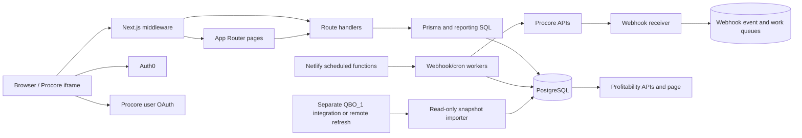

# Analytics application architecture

Last verified against the repository on 2026-08-26.

This document is the fast-start map for the application. It describes the current implementation, including transitional systems that have not yet been retired. When it conflicts with executable code, `prisma/schema.prisma`, or a migration, those sources win and this map should be updated.

## Purpose

This repository is an internal construction operations and analytics application. It combines:

- project, KPI, estimating, scheduling, workforce, equipment, and onboarding workflows;
- Procore project, estimating, budget, commitment, timecard, productivity, and change-management data;
- read-only QuickBooks project-profitability snapshots; and
- scheduled reconciliation, notification, and health-monitoring jobs.

It is a single Next.js application rather than a collection of independent services. Most browser pages call local Next.js route handlers, and those route handlers read or write PostgreSQL through Prisma.

## System at a glance



The important boundary is that interactive analytics reads use PostgreSQL. Procore network calls belong in OAuth-enabled tools, explicit maintenance operations, or secret-authenticated sync workers.

## Runtime and deployment

| Concern | Implementation |
| --- | --- |
| Web framework | Next.js 16 App Router, React 19, TypeScript |
| Database | PostgreSQL through Prisma 6 |
| Hosting | Netlify; `netlify.toml` publishes `.next` |
| Scheduled/background work | Netlify functions in `netlify/functions/` calling internal cron/sync routes |
| User authentication | Auth0 v4 through `src/lib/auth0.ts` and `middleware.ts` |
| Procore authentication | User OAuth cookies for interactive work and client credentials for server workers |
| Tests | Node's built-in test runner over `test/*.test.mjs` |
| Styling/UI | App-level CSS plus React components; Chart.js and PDF libraries are used by reporting surfaces |

`src/app/layout.tsx` installs `AppChrome` and starts permission initialization. `src/app/page.tsx` is the operational home page. Navigation and feature visibility are assembled in `src/components/Navigation.tsx` and the permission helpers.

## Repository map

| Path | Responsibility |
| --- | --- |
| `src/app/` | App Router pages, layouts, and API route handlers |
| `src/app/api/procore/` | Interactive Procore tools, sync endpoints, clone/migration operations, and live-mirror reads |
| `src/app/api/cron/` | Secret-authenticated incremental, nightly, reconciliation, reminder, notification, and health work |
| `src/app/api/webhooks/procore/` | Durable Procore webhook receipt and queued processing |
| `src/lib/` | Database, authentication, permissions, analytics, project identity, Procore, QBO, and scheduling domain logic |
| `src/lib/scheduling/` | Bridges between Gantt and legacy scheduling representations |
| `prisma/schema.prisma` | Current Prisma model surface |
| `prisma/migrations/` | Deployed database evolution and materialized-view/index changes |
| `netlify/functions/` | Schedulers and long-running wrappers for internal API workers |
| `scripts/` | Imports, audits, backfills, repairs, reconciliation, and controlled manual syncs |
| `test/` | Focused business-logic and source-contract tests |
| `config/` | Versioned cost-code and PMC grouping configuration |
| `docs/` | Current operational and architecture notes |
| `data/`, `logs/`, `snapshots/`, `repair-plans/` | Evidence, exports, audit results, and operational plans; not application source of truth |

## Request authentication and permissions

### Auth0 session

`src/lib/auth0.ts` configures the Auth0 client. `middleware.ts` enforces sessions for normal pages and APIs, returns JSON errors to unauthorized API callers, and redirects browser requests to login where appropriate. Session cookies use `SameSite=None` and `Secure` so the application can operate inside an allowed Procore iframe.

### Permission resolution

The access path is:

1. `src/lib/permissionRoutes.js` maps page and API prefixes to permission keys.
2. `middleware.ts` determines the required key, including a few route-specific fallbacks.
3. `src/lib/permissions.ts` loads user assignments from the database and expands permission groups/templates. Environment JSON is a compatibility fallback.
4. A signed permission cookie reduces repeated database checks, but the Auth0 identity remains the session source.

When adding a protected page and API, update both route maps and confirm that the intended permission appears in navigation. Special unauthenticated paths are intentionally narrow: Auth0 routes, the public version endpoint, Procore webhook receipt, secret-authenticated worker routes, and limited Procore-session analytics entry.

### Diagnostics and rate limits

Production diagnostics/test routes are blocked unless explicitly enabled. Middleware also applies general API rate limits and stricter limits to expensive Procore sync/estimating routes. Preserve those controls when moving or renaming endpoints.

## Procore integration

### Central client

`src/lib/procore.ts` owns the base URLs, redirect resolution, OAuth exchanges, client-credentials token cache, outbound request timeout, the `Procore-Company-Id` header, and 429 retry behavior.

There are two authentication lanes:

- Interactive lane: `/api/auth/procore/login` and `/api/auth/procore/callback` obtain a user OAuth session used by browser-driven tools.
- Worker lane: scheduled jobs use client credentials and authenticate internal calls with `x-sync-secret` or a bearer equivalent.

Outbound requests through `makeRequest` are blocked when `PROCORE_LIVE_API_ENABLED` is false unless the call is inside an approved authenticated-session or sync-secret bypass. Normal production browsing should not require the global live-API switch.

Commitment Maker project hydration reads approved COs, purchase orders, and vendor identity from synchronized PostgreSQL so opening a Project Home link does not wait on sequential Procore APIs. PO vendor names fall back through the project and company vendor mirrors when the commitment snapshot contains only a vendor ID. Preview/create still resolve the selected CO and validate the write target against authoritative live Procore data before any mutation. Estimate imports resolve workbook base cost codes against the selected project's WBS. Approved change-order imports retain each source line's project WBS ID and cost type. Procore requires that Budget Code on every created purchase-order or commitment-change-order line, so unresolved lines block creation during preview rather than being submitted without a WBS assignment. New-PO retries identify an existing result by the server-generated change-order title plus the fixed vendor because Procore's Commitment Contracts v2 read response does not expose the submitted `origin_data`; an Approved match wins over a partial Draft. Existing-PO vendor checks use the normalized Procore vendor name because the commitment response's project-scoped vendor ID can differ from the company-directory vendor ID. Before any Procore mutation, approved-CO imports atomically claim their source identities in `commitment_maker_change_order_applications` and `commitment_maker_change_order_aliases`. The alias primary key is project-wide, and a PCCO claims both its package ID and every contained PCO ID, so one business change order cannot be added twice to the same PO or redirected to another PO. Active claims use a five-minute lease; failed or expired work may resume only against its originally claimed target.

### IDs and source systems

Keep these identifiers distinct:

| Identifier | Meaning |
| --- | --- |
| `companyId` / `company_id` | Procore company scope |
| `procoreProjectId` / `procore_project_id` | Project ID used by project-scoped Procore APIs and canonical joins |
| `bidBoardId` / `bid_board_id` | Estimating bid-board project ID |
| `proposalId`, `bidPackageId`, `bidFormId`, `bidId` | IDs inside the estimating hierarchy |
| Prisma `id` | Local row identity; not automatically an external project ID |
| `jobKey`, name, customer, project number | Display and compatibility fields, not reliable primary joins |

The current application still contains older paths that use `Project.id`, `jobKey`, or fallback matching. New work should prefer explicit `companyId + procoreProjectId` joins and should not introduce more fuzzy runtime identity.

### Persistence layers

Procore data is stored in several intentional layers:

- Canonical project direction: `PmcProject` and `PmcBidBoardProject` (`pmc_projects`, `pmc_bid_board_projects`).
- Transitional local project/scheduling models: `Project`, `ProjectScope`, `Schedule`, `ScheduleAllocation`, `ActiveSchedule`, and `ScopeTracking`.
- Gantt v2: `GanttV2Project`, `GanttV2Scope`, and `GanttV2ScheduleEntry`.
- Transactional mirrors: timecards, productivity logs, budgets, commitments, purchase-order detail, estimates, and change orders.
- Raw/live/staging mirrors: `procore_*_live`, estimating/bid tables, staging rows, and preserved JSON payloads.
- Operational state: webhook events/queue, project sync state/control, Commitment Maker source-CO applications, run logs, and productivity/timecard notification records.

`PmcProject` is the destination for canonical identity, but the migration is incomplete. Project sync and webhook handlers still update legacy rows, and scheduling uses explicit bridge code between Gantt and `ProjectScope`. Do not remove a legacy write or table because a `pmc_*` equivalent exists; first trace all reads, dual writes, backfills, and parity checks.

### Full and incremental syncs

The broad sync runner in `src/lib/cronSync.ts` calls focused route handlers for projects, bids, estimates, budget line items, commitments, purchase-order details, timecards, and productivity logs. It records a `SyncLog` and refreshes these materialized views when present:

- `bid_board_latest_mv`
- `budget_agg_mv`
- `commitments_agg_mv`

For steady-state operation, `netlify/functions/scheduled-sync.mts` runs every five minutes. It:

1. drains queued Procore webhook events;
2. reconciles productivity-review reminders;
3. processes timecard notifications;
4. dispatches a background worker that polls PCO/PCCO header status in bounded project batches and queues newly approved verification tasks; and
5. dispatches actuals or nightly-structure work according to the America/New_York time window.

The background wrappers call `/api/cron/actuals`, `/api/cron/nightly-structure`, `/api/cron/project-onboarding`, and `/api/cron/project-reconciliation` in bounded batches. Queue state, locks, retry timestamps, and rate-limit cooldowns live in PostgreSQL so work can resume across invocations. The full active-project reconciliation runs daily at 07:10 UTC and health monitoring allows 26 hours between successful completions. The Actuals wrapper advances due Actuals projects before secondary estimate, onboarding, and purchase-order work can consume the shared Procore quota; a rate limit then stops the remaining secondary work for that invocation. Successful daily structure and estimate records requeue five minutes short of 24 hours so second-level scheduler jitter cannot push them past the final nightly tick. Secret-authenticated operators can pass one exact `projectId` to `/api/cron/nightly-structure` for a targeted structure rerun.

Bid Board header reconciliation protects against incomplete service-account visibility with a coverage threshold. Rows already marked `sync_missing_from_procore` remain as historical evidence but are excluded from the expected-visible denominator; otherwise old deletions would permanently lower coverage and block every later header sync. Repeated header-sync failures are evaluated directly by the production health monitor.

Change-order mirroring treats an unavailable Potential Change Order child-line resource as a warning when Procore still returns the valid parent in its project list. The sync preserves the parent and prior line snapshot instead of failing the entire project or deleting data based on that transient/stale 404. When a mirrored Potential Change Order or Prime Contract Change Order transitions into Approved, the sync enqueues its commitment-verification task before persisting the new status so a queue failure remains retryable.

### Webhook flow

`POST /api/webhooks/procore` verifies `PROCORE_WEBHOOK_SHARED_SECRET`, stores the raw event, and creates queue work in a transaction. It does not perform the full sync inline.

`POST /api/webhooks/procore/process` requires the sync secret, claims due queue entries, dispatches resource-specific handlers, updates canonical and compatibility tables, retries transient failures with backoff, and can enqueue project onboarding work. Potential Change Order and Prime Contract Change Order handlers fetch the current Procore record and immediately enqueue commitment verification when its authoritative status is Approved if those event resources become available. The production Procore webhook catalog does not currently expose those resources, so `/api/cron/change-order-approvals` provides the active five-minute header-only approval detector. This separation keeps webhook acknowledgement fast and processing durable.

Project onboarding parks explicitly identified internal/demo non-job projects instead of retrying them forever when they have no Bid Board record. Production projects continue to retry until their Procore/Bid Board link becomes available.

The project-scoped Commitment Maker supports base-estimate workbooks and approved Prime Change Orders. Change-order mode reads SOV lines directly from either an approved Prime Change Order package or an approved Potential Change Order that has not yet been rolled into a package, so it does not accept or require a second workbook. A PCO already represented by a PCCO is suppressed to avoid showing the same change twice. The durable source-CO claim also links a PCCO to its contained PCO identities, blocks completed and concurrent applications during preview and create, and binds recovery to the first target PO. The user can create a new approved PO or select an existing Paradise Masonry PO; the latter creates the parent record through Procore's v1 Commitment Change Orders resource, adds its SOV through the v2 Commitment Change Order Line Items resource, and approves that same v1 record. `change_order_packages` IDs are not interchangeable with Commitment Change Order IDs and must not be sent to the v2 line-item resource. The source Prime CO, target, and normalized lines are included in a marker stored in the CCO description so interrupted retries resume the same CCO without duplicating it. PCO/PCCO approval idempotently creates a tagged, due-today commitment-verification Task Item assigned only to project-team Project Manager(s) whose email is under `pmcdecor.com`. After the commitment succeeds, Commitment Maker idempotently creates only the tagged AIA-billing task assigned to `shelly@pmcdecor.com`, due on its PMC Eastern creation date. Existing task assignees and distribution members are preserved when a tagged task is revisited. If no eligible Project Manager exists at approval, the commitment-verification task is skipped and an idempotent alert is emailed only to `todd@pmcdecor.com`.

Authoritative Commitment Maker preview/create reads honor Procore's `x-rate-limit-reset` epoch before retrying a temporary 429, but cap the wait so the browser still receives a structured response inside Netlify's synchronous request window. Shared background Procore requests use the same reset-aware delay calculation with their longer configured cap. Mutation requests are not automatically replayed by the Commitment Maker.

After a change-order commitment is approved, the browser request attempts the AIA Task Item immediately and records the result. If that attempt fails, it durably enqueues AIA-only recovery work in `ProcoreSyncProjectState`; a Netlify background function and five-minute scheduler process due retries. Approval-triggered verification uses the same queue with a distinct task-kind payload, and old payloads without a task kind remain backward compatible. Task creation remains idempotent through the source-change-order tags. Commitment-change-order retries consult both Procore and the durable audit fingerprint, then verify an audited ID live before creating anything; this covers Procore list eventual consistency without reviving a deleted record.

Project-completion productivity review tasks use the same assignee rule: only active project-team Project Managers with an exact `@pmcdecor.com` email can be newly assigned. Existing task recipients are preserved. If no eligible Project Manager exists, task creation is skipped and an idempotent alert is emailed only to `todd@pmcdecor.com`.

## QuickBooks profitability

This repository does not own QuickBooks OAuth or write back to QuickBooks. The separate `QBO_1` integration produces a normalized JSON export, or a configured remote webhook triggers that refresh.

`scripts/importQboProjectProfitability.mjs`:

1. reads an explicit file or the newest matching `QBO_1/reports` export;
2. validates and normalizes the payload;
3. hashes the source to make imports idempotent;
4. writes an immutable `QboProfitabilitySnapshot` with normalized project rows; and
5. stores drill-through details when the table is available.

The `/accounting/project-profitability` page and API read the latest stored snapshot, join Procore/estimating context, apply explicit QBO project exclusions, and expose refresh actions only to administrators or the accounting permission. Keep credentials and refresh-pairing material server-side.

## Analytics and reporting

Analytics route handlers combine normalized database facts rather than calling Procore on demand. Important inputs include:

- `pmc_projects` and `pmc_bid_board_projects` for project identity/status;
- budget line items for planned quantities and costs;
- `TimecardEntry` for labor actuals;
- `ProductivityLog` and purchase-order line detail for installed quantities/cost-code attribution;
- estimating proposal/line-item mirrors for sales and estimate reporting;
- approved change-order package lines for contract/hour adjustments; and
- QBO snapshots for accounting revenue, cost, billing, and profitability views.

Shared calculations belong in modules such as `src/lib/costCodeSalesAnalytics.ts`, `src/lib/estimatingDashboard*.ts`, `src/lib/financialWip.ts`, and the QBO exclusion/contract-value helpers. Prefer adding tested functions there over embedding more calculations in page components.

## Scheduling

Scheduling currently spans three representations:

- legacy operational scheduling (`ProjectScope`, `Schedule`, `ScheduleAllocation`, `ActiveSchedule`);
- Gantt v2 tables and `src/lib/ganttV2Db.ts`; and
- the target `PmcProjectScope`, `PmcScheduleEntry`, and `PmcScheduleAllocation` models.

The Gantt-to-legacy bridge uses `ProjectScope.ganttV2ScopeId` as its strongest link. `src/lib/scheduling/ganttScopeToPrismaScope.ts` and related sync helpers preserve dual-write behavior. Changes to scope creation, movement, deletion, dates, hours, or predecessor links must be checked in the Gantt APIs, short-term scheduling, long-term scheduling, and bridge tests.

## Other application-owned domains

The Prisma schema also owns users/permissions, employees and job titles, holidays/time off, crew templates, handbook signoffs, equipment and assignments, certifications, onboarding submissions, KPI entries, estimating constants, and concrete orders. These are app-owned records, not Procore raw mirrors, even when some fields reference project information.

## Environment configuration

Use `.env.example` and `.env.local.example` as starting points, then verify actual reads with `process.env` searches. Core groups are:

- Database: `DATABASE_URL`, `DIRECT_DATABASE_URL`, Prisma pool controls.
- Application/Auth0: `APP_BASE_URL`, Auth0 domain/client/secret variables, permission-cookie secret.
- Procore: client ID/secret, company/base/token URLs, redirect URI, live-API gate, sync secret, webhook secret, retry/sync tuning.
- QBO bridge: integration root or remote refresh URL, webhook secret, HMAC pairing key, timeout, optional Node executable.
- Notifications: Resend credentials, recipient lists, sender addresses, notification timing.
- Hosting: `URL`, frame ancestors, deployment metadata, and diagnostic switches.

Never copy real values into this file, tests, source, or committed examples.

## Development and verification

```text
npm run dev                  Start Next.js with webpack
node --test test/x.test.mjs  Run one focused test
npm test                     Run all node:test files
npx tsc --noEmit             Type-check
npm run lint                 Lint application source
npm run verify               Type-check, test, and lint
```

`npm run build` is not a read-only check: it runs failed-migration resolution, `prisma migrate deploy`, Prisma generation, and then `next build`. Verify the configured database before running it.

## Change checklist by area

### New page or API

- Add the App Router page/route.
- Add page and API permission mappings where required.
- Confirm navigation visibility and unauthorized behavior.
- Keep server-only credentials and data access out of client components.
- Add a focused test for reusable behavior or route-source invariants.

### Procore data change

- Identify the exact external ID and company scope.
- Reuse the central request/token/rate-limit helpers.
- Decide which canonical, transitional, raw, and operational tables need updates.
- Check webhook, full-sync, actuals, onboarding, and reconciliation paths for parity.
- Use bounded, idempotent writes and preserve source payloads where the mirror contract expects them.

### Prisma/data-model change

- Update `prisma/schema.prisma` and add an additive migration.
- Check raw SQL, materialized views, scripts, and generated-client assumptions.
- Plan backfill, parity measurement, and rollback before removing a transitional field/table.
- Do not use a production-connected build merely to validate migration syntax.

### Analytics calculation change

- Trace the originating snapshot/mirror and its freshness path.
- Put calculations in a reusable library module.
- Add edge-case tests for nulls, zero denominators, duplicate rows, exclusions, and status filters.
- Verify page totals and drill-through use the same identity and filtering rules.

## Known sharp edges

- The schema is large and contains transitional, raw, backup, and app-owned models together. A model's existence does not mean it is the preferred source for new reads.
- Some old root documentation refers to Firebase/Firestore or earlier Procore endpoints. Verify it against imports and active route code before relying on it.
- Several operational scripts contain default targets or can become destructive when a flag changes. Read the entire script before execution.
- Raw SQL sometimes exists because generated Prisma types lag a migration or because reporting needs database-native constructs. Do not mechanically replace it without checking the database contract.
- Production Procore access is intentionally split between an interactive safety gate and authenticated worker bypasses. Turning on the global live-API flag is not the normal fix for a worker problem.
